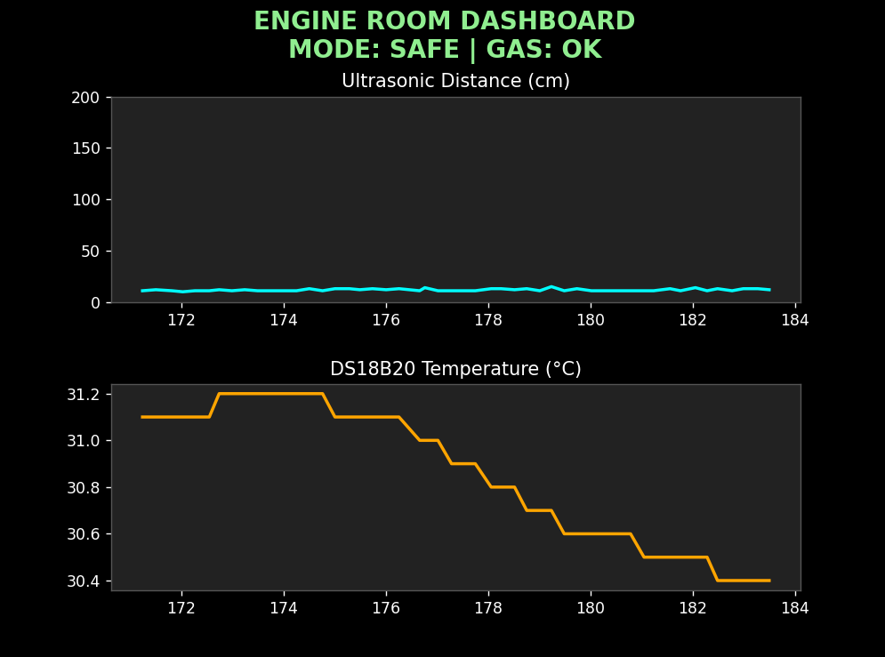

# Engine Room — Vitals Monitoring System

[](https://ujjvxl.github.io/Ship-Engine-Room-Safety-Monitor-/)

> 🚀 **Live Interactive Presentation Deck**: [https://ujjvxl.github.io/Ship-Engine-Room-Safety-Monitor-/](https://ujjvxl.github.io/Ship-Engine-Room-Safety-Monitor-/)  
> Featuring interactive 3D flip cards, live engine safety state simulator, sound feedback, and dual-video demonstration player.

A real-time embedded monitoring system built on the **STM32F411CEU6 (Black Pill)** that watches distance, temperature, and gas levels, decides a hazard mode, drives local alerts (LEDs/buzzer/OLED), and streams telemetry to a live Python dashboard.

<p align="center">
  <br/>
  <sub><b>Assembled Hardware</b></sub>
</p>
<p align="center">
  
  
  
</p>
<p align="center">
  <sub><b>STM32CubeIDE Pinout</b></sub>&nbsp;&nbsp;&nbsp;&nbsp;&nbsp;
  <sub><b>Python Live Dashboard</b></sub>&nbsp;&nbsp;&nbsp;&nbsp;&nbsp;
  <sub><b>Serial Terminal Output</b></sub>
</p>

## Sensors Used

| Sensor | Interface | Purpose |
|---|---|---|
| HC-SR04 | Timer Input Capture (TIM2, echo pulse width) | Distance sensing |
| DS18B20 | 1-Wire (bit-banged via DWT delay) | Temperature sensing |
| Gas sensor (digital out) | GPIOA5, pull-up input | Gas/smoke alert |
| SSD1306 OLED | I2C1 | Local status display |

## Multitasking on the STM32 — Non-Blocking Superloop

No RTOS is used. Instead, everything runs in a single `while(1)` loop scheduled using **`HAL_GetTick()` timestamps**, so no task ever blocks another:

- **Ultrasonic trigger** — fired every 100 ms; the echo width is captured entirely in the background via the TIM2 input-capture interrupt (`HAL_TIM_IC_CaptureCallback`), so the CPU never waits for the echo.
- **DS18B20 read** — implemented as a 2-state machine (`ds18b20_state`): state 0 issues the "start conversion" command and starts a timer; state 1 waits the required 750 ms conversion time (checked non-blockingly) before reading back the result. No `HAL_Delay()` is used.
- **Mode evaluation + actuation** — runs every loop iteration, instant reaction to sensor state.
- **Buzzer** — toggled on its own timer interval (100 ms in EMERGENCY, 500 ms in HAZARD) using the same tick-difference pattern.
- **OLED + UART update** — batched together every 250 ms to avoid spamming the display/serial link.

Each subsystem owns its own `last_*_time` timestamp and only acts once its interval has elapsed — the classic "blink without delay" pattern extended across four independent subsystems running concurrently on one core.

## Communication Setup & Packet Format

- **UART1 @ 115200 baud, 8N1**, TX only for telemetry.
- Every 250 ms the firmware emits a single-line, human-readable, regex-friendly packet:

```
[DIST:23|TEMP:31.4|GAS:OK|MODE:SAFE]
```

- Fields: `DIST` (cm, int), `TEMP` (°C, 1 decimal), `GAS` (`OK`/`ALERT`), `MODE` (`SAFE`/`HAZARD`/`EMERGENCY`).
- The PC-side Python script parses this with a single regex and updates the live plots — keeping the STM32 firmware dumb/fast and pushing all interpretation to the PC side.

## Decision Algorithm — 3 Modes

Simple, deterministic combinational logic evaluated every loop cycle:

```
gas_alert  = gas pin reads LOW
temp_alert = temperature >= 45.0 °C

gas_alert AND temp_alert   -> EMERGENCY   (red LED, buzzer @100ms)
gas_alert OR  temp_alert   -> HAZARD      (yellow LED, buzzer @500ms)
neither                    -> SAFE        (green LED, buzzer off)
```

Mode drives LED selection, buzzer interval, OLED banner, and the `MODE` field in the UART packet — a single source of truth used everywhere downstream.

## Python Dashboard & Tooling

`Python_dash.py` — a live serial telemetry viewer:

- Reads the UART packet stream via `pyserial`, parsed with regex.
- Runs on two background threads: one for serial read + optional CSV logging, one for terminal input (`LOG` toggles logging on/off, timestamped CSV per session).
- Live dual-plot Matplotlib dashboard (rolling 50-sample window) — distance and temperature over time, with a color-coded title (green/yellow/red) matching the current mode.

## System Info — Clocks, Timers, GPIO

- **MCU:** STM32F411CEU6, Cortex-M4 @ 96 MHz (HSE + PLL: M=12, N=96, P=2)
- **APB1:** 48 MHz, **APB2:** 96 MHz, Flash latency 3WS
- **TIM2:** 16-bit, prescaler 100 → 960 kHz tick, input-capture on CH1 (rising edge) for HC-SR04 echo timing
- **I2C1:** 400 kHz Fast Mode → SSD1306 OLED
- **USART1:** 115200 baud, TX telemetry to PC
- **1-Wire (DS18B20):** bit-banged on PA1 using DWT cycle counter for µs-accurate timing

### Pinout

| Pin | Function |
|---|---|
| PA1 | DS18B20 (1-Wire) |
| PA5 | Gas sensor input (pull-up) |
| PB8 | HC-SR04 TRIG |
| TIM2_CH1 | HC-SR04 ECHO (input capture) |
| PB12 | LED — Safe (Green) |
| PB13 | LED — Hazard (Yellow) |
| PB14 | LED — Emergency (Red) |
| PB15 | Buzzer |
| I2C1 (SCL/SDA) | SSD1306 OLED |